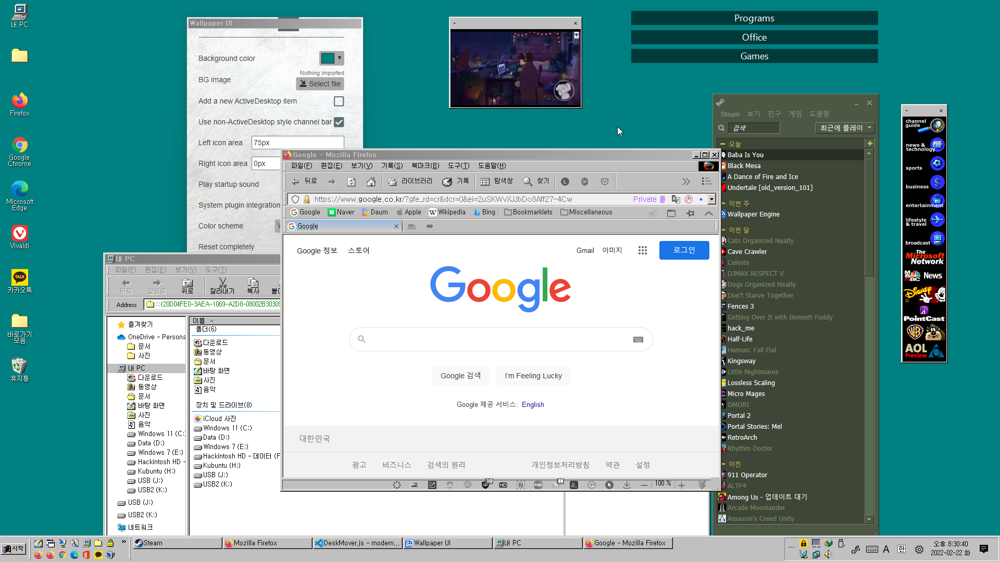

# Welcome to ModernActiveDesktop!
* ModernActiveDesktop, also known as Windows 98 Desktop Experience, aims to improve the Classic Theme experience on modern Windows, while upgrading the old ActiveX/OLE-based Active Desktop codes to modern HTML5 ones.
* Designed for Wallpaper Engine.
  

## Basic Usage Guide
* You can change MAD's settings within Wallpaper Engine. Open the Wallpaper Engine wallpaper selection window, then you'll see the properties panel on the right side.
* In the properties panel, you can configure the background, change the color scheme, turn on or off the Windows 98 startup sound, change the Active Desktop item style, and so on. Try them out now!
* To add a new Active Desktop item on your desktop, click the empty box next to the 'Add a new ActiveDesktop item', and a new window will appear. To load a website into it, move the cursor near its upper side, click the ⏷ button, choose Configure, then enter your desired address in the prompt window.
* For the better usability, it is highly recommended to install the system plugin. It allows for the wallpaper to open a new browser window and apply the system color scheme to the wallpaper (if you're using a Classic Theme.) For more information, please refer to the [system plugin setup guide](SysplugSetupGuide.md).
* To reset one window, click its ⏷ button, choose Reset, and its position, size, and URL will be reset. To completely reset, go to the Wallpaper Engine properties panel, click the big red Reset button first, then click the 'Reset completely' button. Everything will go back to the initial state.

## Changelog

### 2.1
* Added a scaling feature for high DPI displays
    * Configurable in the properties panel
 
* Added error handling
* Code improvements

### 2.0
* Added a system plugin for better usability
    * Open pages with ChannelViewer in a new window or with your default browser
    * Use system color scheme for theming the wallpaper
* Support non-ActiveDesktop style windows
* Support multiple color schemes
* Support multiple Active Desktop item windows
* Show a documentation window on first run

Copyright (c) 2023 Ingan121/RomanHue  
[Licensed under the MIT license](license.txt)