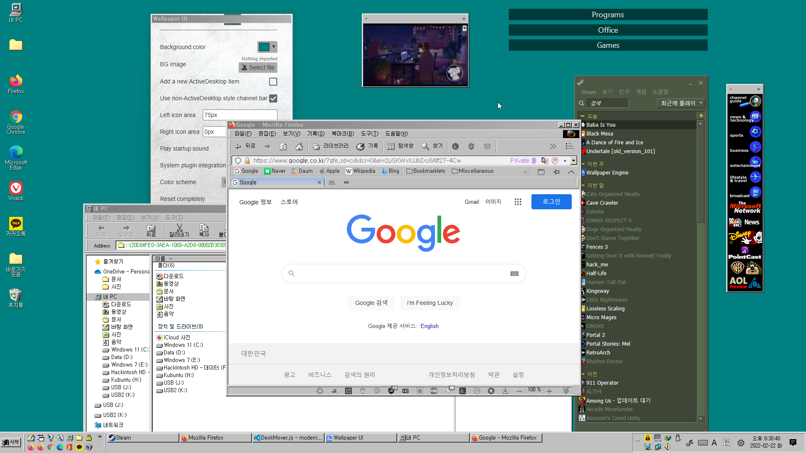
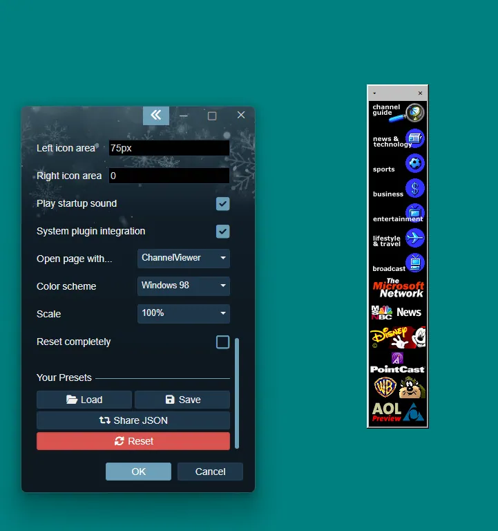

# ModernActiveDesktop

* ModernActiveDesktop, also known as Windows 98 Desktop Experience, aims to replicate the original Active Desktop behavior and improve the Classic Theme experience on modern Windows.
* This wallpaper includes Windows 98's Channel Bar, the startup sound, a music visualizer, and various apps like paint and solitaire.
* Designed for Wallpaper Engine.
   
* [Steam Workshop](https://steamcommunity.com/sharedfiles/filedetails/?id=2278898637)
* [Try in your browser](https://www.ingan121.com/mad/)

## Changelog

### 3.1
* Added a music visualizer
    * Currently supports WMP Bar-like visualizer and a simple album art visualizer
    * Supports customizable colors and media information integration
    * Also supports media controls if the system plugin integration is enabled
* Added a customizable flat menu option, which was previously exclusive to the XP theme
* Background colors can now be changed independently when using system colors
* Added thick frames to resizable windows for a more authentic look
* Added an option to make windows non-resizable
* Added various sound schemes (3.1, 95, NT4, 2000/Me, XP, Vista, 7, 8, 10, 11)
* Improved the XP theme
    * Dialogs will use XP icons when using the XP theme
    * Title bars will always use appropriate fonts, regardless of the no-pixel fonts option
* Changed the default style and size of new windows
* Several visual improvements
* Prevent Windows 7 / 8 from installing the system plugin, as it requires Windows 10 or higher
* Added an additional safeguard to prevent arbitrary web pages from accessing the system plugin APIs
* System plugin is now distributed zipped
* Several bugfixes and optimizations
    * Fixed dark color schemes having invisible checkmarks on checkboxes
    * Fixed dark theme detection not working properly with custom colors
    * Fixed 'Always on top' windows going on top of important UI elements and its own dialogs
    * Fixed the default color scheme having some inaccurate colors
    * Fixed the circle mark in context menus being rendered as broken texts in some cases
* Updated dependencies

### 3.1.1
* Removed an unnecessary zip file that contained a full copy of itself duplicated
* Fixed an error in environments other than Wallpaper Engine that happened by a visualizer-related code
* Visual improvements to the Windose theme

### 3.1.2
* Fixed a critical error occurring on the first start or after reset

### 3.0
* Added a new 'Window' styling
* Improved the configuration UI
    * Added a lot of color schemes and themes, including an XP theme
    * Added the ability to customize color schemes fully
    * Added an option to use non-pixel fonts
    * Added an option to change or disable the animation effects
* Added various apps for your desktop experience
    * JS Paint and Solitaire are currently included
    * Both are optimized for use within ModernActiveDesktop and Wallpaper Engine
* Added a new welcome screen
* Added an option to keep a window on top of other windows
* Added a basic support for CSS themes
* Windows won't be created in the same position over and over anymore
* 'Reload' in the main window context menu will only reload that window
    * Use Configure -> Reload wallpaper to reload the whole wallpaper
* Overhauled the general code base
    * Optimized the configuration saving mechanism
    * Unused configs are automatically cleaned up
    * Allows accessing DeskMover functions globally
    * Improved the context menu opening and closing mechanism
    * Various codes are simplified
* Updated dependencies
    * Fixed security vulnerabilities found in old components (Electron, minimist)
* System plugin now only accepts connection from localhost
    * Provides safety for devices that are connected to the internet without a router
    * Can be overridden with --listen argument but is not recommended
* Added devtools support in the system plugin ChannelViewer
    * Click the toolbar first then press F12

### 2.3
* Added an option to disable scaling per window
* Fixed some websites (e. g. YouTube embed) not displaying properly when scaled
* Made the window configuration context menu look better
* Updated dependencies

### 2.2
* Added support for video and web backgrounds
    * Configurable in the properties panel
* Windows can now be placed off-screen, as long as its title bar is still visible
* Window Z-orders are now persistent across reloads
* Added per-window style setting
* Fixed bugs with window resize and reset
* Replaced default dialogs with 98-styled ones
* Added initial support for Lively Wallpaper
* Added a standalone properties panel for non-Wallpaper Engine usage
* Added a right-click menu for browser usage
* Resetting windows no longer reloads the entire wallpaper
* Added advanced debugging features
* Major code improvements

### 2.1
* Added a scaling feature for high DPI displays
    * Configurable in the properties panel
 
* Added error handling
* Code improvements

### 2.0
* Added a system plugin for better usability
    * Open pages with ChannelViewer in a new window or with your default browser
    * Use system color scheme for theming the wallpaper
* Support non-ActiveDesktop style windows
* Support multiple color schemes
* Support multiple Active Desktop item windows
* Show a documentation window on first run

Copyright (c) 2024 Ingan121  
[Licensed under the MIT license](license.txt)
