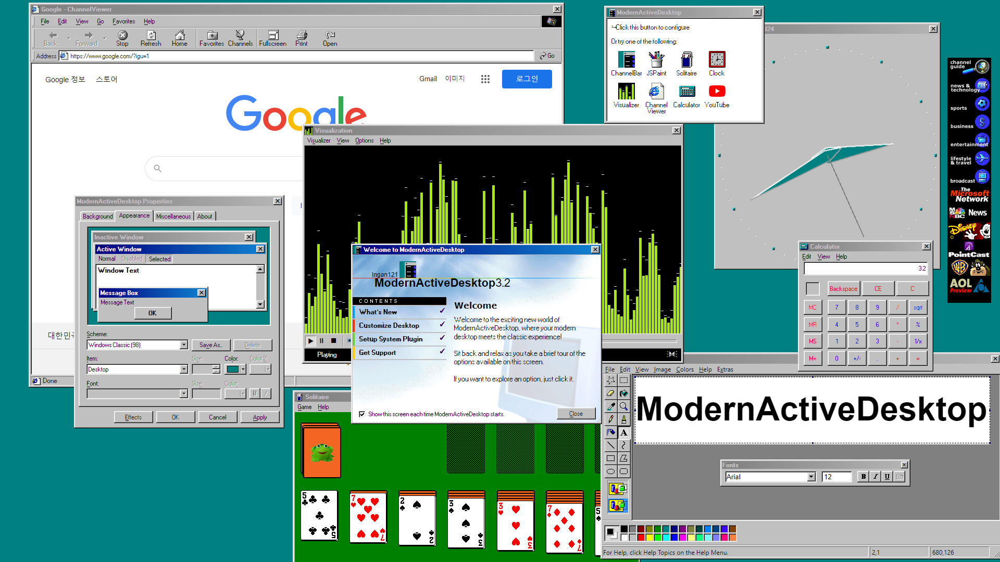

# ModernActiveDesktop

* ModernActiveDesktop, also known as Windows 98 Desktop Experience, is a highly customizable re-creation of the classic Windows desktop.
* Started as a crappy Active Desktop clone, ModernActiveDesktop now features various useful apps that resemble the classic Windows components that will improve your desktop experience.
* Primarily designed for Wallpaper Engine, but now it should work well on other modern browsers as well. Lively Wallpaper is also supported.
  

[Video Screenshot](buildstuff/screenshotview.md)  
[Old Screenshot (circa 2.3)](docs/images/screenshot.png)
  
* [Steam Workshop](https://steamcommunity.com/sharedfiles/filedetails/?id=2278898637)
* [Try in your browser](https://www.ingan121.com/mad/)

## Included Apps
|Icon|Name|Description|Links|
|---|---|---|---|
||Channel Bar|The Channel Bar from Windows 98 First Edition or IE4|[Link](https://github.com/Ingan121/ModernActiveDesktop/blob/master/ChannelBar.html)|
||JSPaint|A web-based remake of MS Paint|[Original](https://github.com/1j01/jspaint) [MAD Version](https://github.com/Ingan121/ModernActiveDesktop/tree/master/apps/jspaint)|
||Solitaire|A web-based remake of MS Solitaire|[Original](https://github.com/rjanjic/js-solitaire) [MAD Version](https://github.com/Ingan121/ModernActiveDesktop/tree/master/apps/solitaire)|
||Clock|A web-based remake of NT4 clock.exe|[Link](https://github.com/Ingan121/ModernActiveDesktop/tree/master/apps/clock)|
||Visualizer|A music visualizer for Wallpaper Engine WMP6 style controls with WMP7+ bar visualization Lively Wallpaper is partially supported|[Link](https://github.com/Ingan121/ModernActiveDesktop/tree/master/apps/visualizer)|
||ChannelViewer|An IE4 remake with some elements of IE6 Supports loading webpages with a classic look and features|[Link](https://github.com/Ingan121/ModernActiveDesktop/tree/master/apps/channelviewer)|
||Calculator|A web-based remake of Windows calculator|[Link](https://github.com/Ingan121/ModernActiveDesktop/tree/master/apps/calc)|
||Configurator|Remake of the 'Display Properties' and 'Internet Options' control panel applets Some of them are pretty pixel-perfect to the original|[Main](https://github.com/Ingan121/ModernActiveDesktop/tree/master/apps/madconf), [Internet](https://github.com/Ingan121/ModernActiveDesktop/tree/master/apps/inetcpl)|

## Included Themes
* XP
    * A CSS theme based on XP.css
    * Fallback schemes: Blue, Olive Green, Silver, and Royale
* Aero
    * A CSS theme based on 7.css
* Windows 9x / 2000 Classic schemes
* Plus! 95 and 98 schemes
* Windose
    * Simple CSS theme based on the looks of Needy Girl Overdose
    * Only the title bars are themed; other controls will use the generic Classic styles
* Catppuccin Mocha
* Windows 1-3 schemes
* Windows 11 high contrast schemes
* Three schemes found in the JSPaint source files
* All Classic schemes feature unique window metrics and font settings
* Can fetch system color schemes if the system plugin is being used
* Also supports loading Windows *.theme files and an exported file of the "HKCU\Control Panel\Colors" registry key

## Todo
* ChannelViewer
    * Hook fetch / XHR with fetchProxy to get AJAX sites working when force-loaded
    * Also deal with the origin header - Google, YT, etc. checks for it and returns 403. This also affects Wallpaper Engine or other environments with the same origin policy disabled.
* WindowMetrics (`extra-border-size`) support for Active Desktop style DeskMovers
* More themes to add
    * Windows 3.x
        * I think it would be pretty easy, just give it flat title bars and buttons with border-radius
    * Windows Vista/7 Basic
    * Windows 8
        * Maybe just modifying the Aero theme a bit would work
    * Aero Lite
    * Windows 10/11?
    * Mac OS 7?
    * Also if I implement the Win3 theme, I should make a separate visual style selector in the appearance control panel, like the one in XP
* Split the main scripts into multiple JS files
    * Current main JS structure (DeskMover + DeskSettings) hasn't really changed since 1.0 lol
* Support multi-display background wallpaper configuration?

## Notes
* ModernActiveDesktop is primarily optimized for Chromium 98 and higher. Some features may not work or look well on other browsers.

## Changelog

## 3.2
* Added Clock and Calculator
* Revamped the ChannelViewer
    * It now more resembles IE4 or IE6
    * It can now open pages that don't allow embedding
    * Improved external link handling
    * Note: the system plugin ChannelViewer has been deprecated. Please use the in-wallpaper ChannelViewer or any external browser on your system
* Improved the customization settings
    * You can now adjust the window metrics and font settings. Updated the built-in themes to have unique metrics as well
    * Made the configuration window pretty pixel-perfect to the 98 appearance control panel
    * Added an option to hide the keyboard navigation underlines
    * Added an option to show only window outlines when dragging
    * Support saving color schemes to the storage
    * Support importing Windows theme files and exported color registry files
    * Support exporting scheme as CSS or JSON by typing !copycss or !copyjson to the scheme save dialog
    * Support adjusting the top and bottom margins. Adjust these based on your desktop, for example, the bottom margin would be the size of the taskbar.
    * Support exporting and importing the complete configuration of ModernActiveDesktop
    * Resetting configs will only remove its own configs and not touch other wallpaper's ones
* Added a Windows Aero theme, and improved the XP theme
    * JSPaint will use Windows Vista or Windows XP looks if you use one of these themes
* Added more Classic schemes
    * Catppuccin Mocha
    * Some Plus! themes that were missing previously
    * Reverted the 98 Classic scheme to 3.0 one, as this was indeed the correct one.
    * The previous 98 scheme of MAD 3.1 has been renamed to Windows Classic (98SE) - in fact, this slightly different variant of the Classic scheme is also present in later versions of Windows.
* More controls, including radio buttons and dropdowns, now follow the color scheme
* Visualizer updates
    * Added more configurable options to the visualizer
    * Added fullscreen mode
    * Automatically pause drawing when idle to reduce the CPU usage
* ChannelBar is now an openable app, like the visualizer and others
    * It no longer re-opens when opening a new window
* Made various UI elements look more accurate
    * Added ClientEdge in various places
* Added localization support
    * Added Korean language
* Windows now can be resized diagonally
* Added support for Firefox and iOS Safari, as well as touchscreens
* Support menu navigation with keyboard (when keyboard input is available)
* Moving the mouse over the menu while playing the animation effect will cancel the animation
* Updated dependencies (Electron, JSPaint)

## Hotfixes
* Corrected the version string
* Fix the XP theme looking broken in some places

## 3.2.1
* Fixed several bugs
    * Placeholder message being shown instead of a proper error message when trying to enable media integration features without having it enabled in Wallpaper Engine settings
    * Effect options not saving well when changing the appearance options
    * Short dropdown lists showing scroll bars when the display scaling is set to higher than 100%
    * Bottom-right resize area of some pages not disappearing when resetting the window or navigating to another page
* Improved the system window metrics retrieval to get more accurate metrics when the system DPI is higher than 100%
* Improved the fullscreen window handling
* Improved menu behavior regarding submenus
* ChannelViewer: Fixed the link navigation not working well on certain pages
* Empty margin input fields will now be treated as 0
* Visualizer improvements
    * Added an option to hide the borders around the visualization area
    * Added an option to adjust the decrement speed
    * Fixed right channel being visible when channel separation is set to 'Combine left and right channels' and fixed bar width is enabled
    * Fixed visualization not showing right after switching from Album Art to WMP Bars
    * Fixed erroneously getting out of idle power-saving state on random occasions
* Added access keys for some elements with an underline

(2024/4/19)

### Previous changelog
Please see [here](docs/Updated.md) for the previous changes

Copyright (c) 2024 Ingan121  
[Licensed under the MIT license](license.txt)
