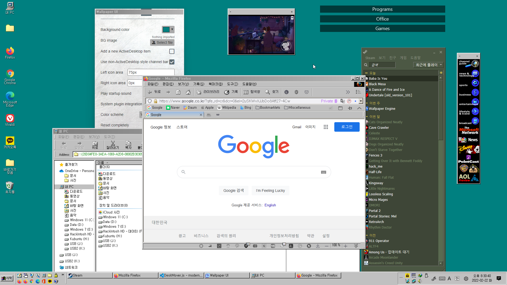

# Welcome to ModernActiveDesktop!
* ModernActiveDesktop, also known as Windows 98 Desktop Experience, aims to replicate the original Active Desktop behavior and improve the Classic Theme experience on modern Windows.
* Designed for Wallpaper Engine and Lively Wallpaper.
  

## Basic Usage Guide
* Place the mouse cursor at the top of a window to show its title bar and menus.
* You can change MAD's settings within Wallpaper Engine. Open the Wallpaper Engine wallpaper selection window, then you'll see the properties panel on the right side.
* In the properties panel, you can configure the background, change the color scheme, turn on or off the Windows 98 startup sound, change the Active Desktop item style, and so on. Try them out now!
* To add a new Active Desktop item on your desktop, click the empty box next to the 'Add a new ActiveDesktop item', and a new window will appear. To load a website into it, move the cursor near its upper side, click the ⏷ button, choose Configure, click Change URL, then enter your desired address in the dialog.
* For better usability, it is highly recommended to install the system plugin. It allows for the wallpaper to open a new browser window and apply the system color scheme to the wallpaper (if you're using a Classic Theme.) For more information, please refer to the [system plugin setup guide](?src=SysplugSetupGuide.md&showbackbtn=1).
    * System plugin does not work with Lively Wallpaper yet.
* To reset one window, click its ⏷ button, choose Reset, and its position, size, URL, and style will be reset. To completely reset, go to the Wallpaper Engine properties panel, click the big red Reset button first, then click the 'Reset completely' button. Everything will go back to the initial state.

## Changelog

### 2.3
* Added an option to disable scaling per window
* Fixed some websites (e. g. YouTube embed) not displaying properly when scaled
* Made the window configuration context menu look better
* Updated dependencies

### 2.2
* Added support for video and web backgrounds
    * Configurable in the properties panel
* Windows can now be placed off-screen, as long as its title bar is still visible
* Window Z-orders are now persistent across reloads
* Added per-window style setting
* Fixed bugs with window resize and reset
* Replaced default dialogs with 98-styled ones
* Added initial support for Lively Wallpaper
* Added a standalone properties panel for non-Wallpaper Engine usage
* Added a right-click menu for browser usage
* Resetting windows no longer reloads the entire wallpaper
* Added advanced debugging features
* Major code improvements

### 2.1
* Added a scaling feature for high DPI displays
    * Configurable in the properties panel
 
* Added error handling
* Code improvements

### 2.0
* Added a system plugin for better usability
    * Open pages with ChannelViewer in a new window or with your default browser
    * Use system color scheme for theming the wallpaper
* Support non-ActiveDesktop style windows
* Support multiple color schemes
* Support multiple Active Desktop item windows
* Show a documentation window on first run

Copyright (c) 2023 Ingan121  
[https://github.com/Ingan121/ModernActiveDesktop](javascript:openUrl('https://github.com/Ingan121/ModernActiveDesktop'))  
[Licensed under the MIT license](?src=../license.txt&showbackbtn=1)