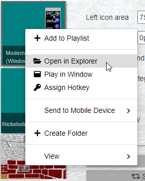

# ModernActiveDesktop System Plugin
The system plugin provides some useful features for your experience with ModernActiveDesktop. More specifically, the system plugin allows the following.
* Opening URLs with the default browser
* Controlling the currently playing media
* Pasting text from your clipboard
* Receiving input from the user
* Saving files from the wallpaper to the disk
* Applying the system color scheme to the wallpaper

## Setup Guide
To install the ModernActiveDesktop System Plugin, please follow the instructions below.
1. Open the Wallpaper Engine's wallpaper selection window.
2. Right-click this wallpaper.
3. Click 'Open in Explorer'  

4. Run the 'Install System Plugin' batch file.  

5. Enter 1.  

6. In the [Properties window](javascript:madOpenConfig('misc')), check the 'Enable system plugin integration' option.  

7. You are all set!