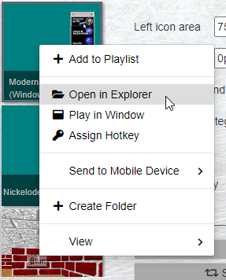
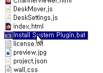
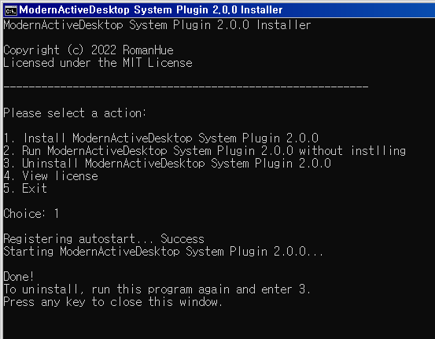
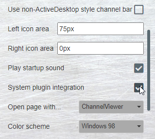

# MAD System Plugin Setup Guide
1. Open up the Wallpaper Engine's wallpaper selection window.
2. Right-click this wallpaper.
3. Click 'Open in Explorer'  

4. Run the 'Install System Plugin' batch file.  

5. Enter 1.  

6. In the Wallpaper Engine properties panel, check the 'System plugin integration' option.  

7. You are all set!