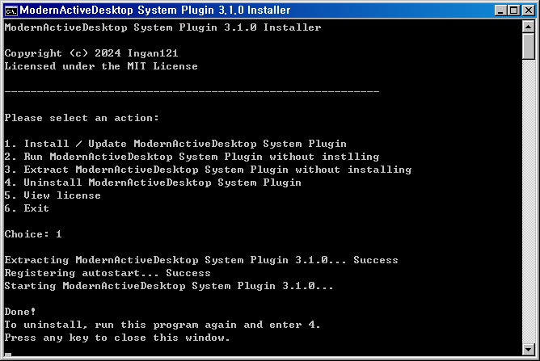
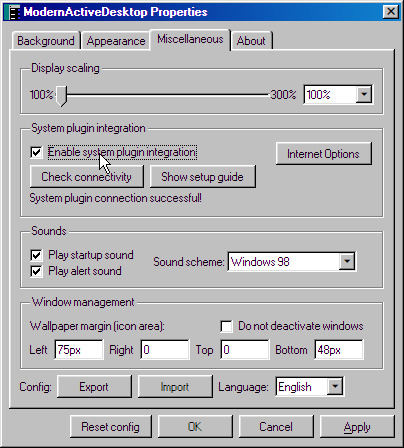

# MAD System Plugin Setup Guide
The system plugin is not really useful when running in browsers, but if you want to try it anyway, here are the instructions.
1. Download the latest system plugin zip file from <a href="https://github.com/Ingan121/ModernActiveDesktop/releases" target="_blank">GitHub Releases</a>
2. Unzip it.
3. Run the 'Install System Plugin' batch file.  

4. Enter 1.  

5. In the [Properties window](javascript:madOpenConfig('misc')), check the 'Enable system plugin integration' option.  

6. You are all set!