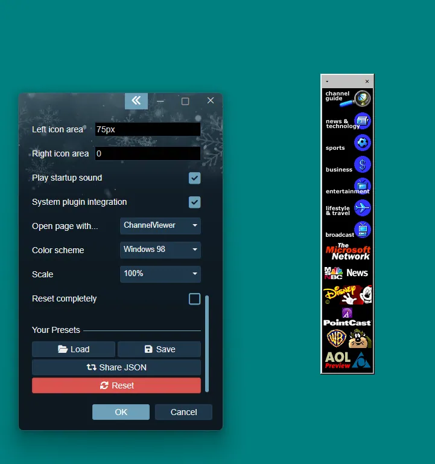

# ModernActiveDesktop has been updated to 2.2

## New features
* Added support for video and web backgrounds
    * Configurable in the properties panel

allow window offscreen
zorder save
per window style
bugfixes - deskmover, reset
98 style dialogs
initial lively wallpaper support

## Previous changelog

### 2.1
* Added a scaling feature for high DPI displays
    * Configurable in the properties panel
 
* Added error handling
* Code improvements

### 2.0
* Added a system plugin for better usability
    * Open pages with ChannelViewer in a new window or with your default browser
    * Use system color scheme for theming the wallpaper
* Support non-ActiveDesktop style windows
* Support multiple color schemes
* Support multiple Active Desktop item windows
* Show a documentation window on first run

Copyright (c) 2023 Ingan121  
[Licensed under the MIT license](?src=../license.txt&showbackbtn=1)