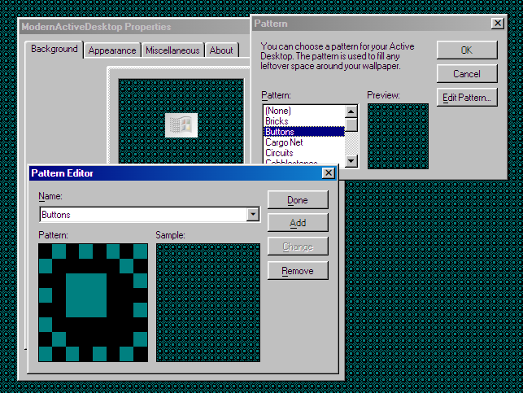

# Changelog

## 3.4
* **Wallpaper Engine 2.4 and below, and Chromium 123 and below are no longer officially supported since this release**
    * While it may still work, not all features are guaranteed to work properly in these environments
    * Please update Wallpaper Engine to the latest version to get the best experience
    * Windows 7/8 users: why not update to Windows 10 LTSC and apply a Windows Classic / Aero / XP theme? Visit [WinClassic](https://winclassic.boards.net/) to learn more!
* Added new themes
    * Windows Basic
    * Windows Classic (16 colors)
    * 93
    * 96
    * Arc-Dark
    * Blur (beta)
* Visualizer improvements
    * Added a lyrics viewer! Click View -> Lyrics to open it
    * Several options are now accessible in the menu bar
    * Added an option to change the size of the album art
    * Added an option to change how the window title is displayed
    * Support displaying the visualization as a background
    * Added an option to ignore the wallpaper margins in the fullscreen or background mode
    * Will use the accent color as a bar color in 'Follow color scheme' mode if the current theme supports accent colors (Aero and Blur)
    * Fixed the difference scale being affected by the window height
* Added a preset system for Wallpaper Engine
    * Click the 'Preset edit mode' in the Wallpaper Engine properties panel to learn more
* Improved the configuration saving mechanism
    * Configurations that can be large are now saved in bigger storage (IndexedDB)
    * Can apply a large background image without a problem
    * Exported configuration data is now compressed if it's large
    * No longer loses information about the Wallpaper Engine properties panel when resetting configurations
    * Handles cases when the storage is full
* Localization improvements
    * Now supports the language code with a region code (e.g., `en-US`)
    * Added a guide document for translating ModernActiveDesktop
* Miscellaneous improvements
    * Clock configurations are now per-window
    * Dropdown lists will be displayed reversed if it's too close to the bottom of the screen
    * Default window placement no longer assumes 1920x1080 or similar resolution; they will be placed relative to the screen size
    * Also new windows will be prevented from being placed off-screen. After these changes, ModernActiveDesktop should now run decently on any resolution higher than 640x480
    * Adjusted some font sizes to look better with the default pixelated font
    * Automatically reset the display scaling factor if the effective screen resolution is smaller than 640x480
* Security improvements
    * Prevent displaying arbitrary HTML (XSS) through imported configuration files
    * Show a warning about loading an unverified page after importing a configuration file
* Fixed several bugs
    * The 'Add custom colors' button in the color picker showing in a weird position with the Aero theme
    * Custom pattern saving not working properly
    * On-screen keyboard window having incorrect frame height in XP and Aero themes
    * Background image set in the Wallpaper Engine properties panel being applied on every startup
    * Some windows behaving weirdly after being reset
    * System colors not being applied to window contents when the system color scheme is changed on startup
    * Textboxes not automatically scrolling when using the arrow keys with the system plugin input or the on-screen keyboard
* Refactored the codebase
    * Minimize the usage of global variables, and export only necessary functions
    * Split the main script into multiple files for better maintainability
    * Renamed some scripts to a shorter name
* Updated Electron

(2024/11/)

## 3.3
* Added support for desktop patterns
    * Available in the background settings page
 
* Reduced the volume of the welcome music
* Fixed various bugs and improved the codebase
    * Clock's second hand being invisible when it's 0, 15, 30, or 45 seconds
    * Multiple instances of Visualizers being allowed under some conditions
    * Background image set in the Wallpaper Engine properties panel not being applied immediately
* Updated Electron

Changes for Wallpaper Engine:
* Fixed the broken keyboard input in Wallpaper Engine 2.5 and newer
    * Tries to use the system plugin for directly receiving keyboard inputs (even in lower WPE versions)
    * If the system plugin is unavailable, an on-screen keyboard will be shown as an alternative
    * An input box in the Wallpaper Engine properties panel can also be used for typing and pasting things without the system plugin. Note that this doesn't support backspaces, ctrl key shortcuts, and arrow keys
* Added a token verification to the system plugin to stop random wallpapers from accessing your system without your consent

Changes for browsers:
* Moved the official page to its own subdomain
* Dialog icons are now preloaded to prevent the slow icon change
* Added support for display scaling on Firefox 126 and newer
* Fixed the display scaling feature broken on recent Chromium update

(2024/9/1)

## 3.2
* Added Clock and Calculator
* Revamped the ChannelViewer
    * It now more resembles IE4 or IE6
    * It can now open pages that don't allow embedding
    * Improved external link handling
    * Note: the system plugin ChannelViewer has been deprecated. Please use the in-wallpaper ChannelViewer or any external browser on your system
* Improved the customization settings
    * You can now adjust the window metrics and font settings. Updated the built-in themes to have unique metrics as well
    * Made the configuration window pretty pixel-perfect to the 98 appearance control panel
    * Added an option to hide the keyboard navigation underlines
    * Added an option to show only window outlines when dragging
    * Support saving color schemes to the storage
    * Support importing Windows theme files and exported color registry files
    * Support exporting scheme as CSS or JSON by typing !copycss or !copyjson to the scheme save dialog
    * Support adjusting the top and bottom margins. Adjust these based on your desktop, for example, the bottom margin would be the size of the taskbar.
    * Support exporting and importing the complete configuration of ModernActiveDesktop
    * Resetting configs will only remove its own configs and not touch other wallpaper's ones
* Added a Windows Aero theme, and improved the XP theme
    * JSPaint will use Windows Vista or Windows XP looks if you use one of these themes
* Added more Classic schemes
    * Catppuccin Mocha
    * Some Plus! themes that were missing previously
    * Reverted the 98 Classic scheme to 3.0 one, as this was indeed the correct one.
    * The previous 98 scheme of MAD 3.1 has been renamed to Windows Classic (98SE) - in fact, this slightly different variant of the Classic scheme is also present in later versions of Windows.
* More controls, including radio buttons and dropdowns, now follow the color scheme
* Visualizer updates
    * Added more configurable options to the visualizer
    * Added fullscreen mode
    * Automatically pause drawing when idle to reduce the CPU usage
* ChannelBar is now an openable app, like the visualizer and others
    * It no longer re-opens when opening a new window
* Made various UI elements look more accurate
    * Added ClientEdge in various places
* Added localization support
    * Added Korean language
* Windows now can be resized diagonally
* Added support for Firefox and iOS Safari, as well as touchscreens
* Support menu navigation with keyboard (when keyboard input is available)
* Moving the mouse over the menu while playing the animation effect will cancel the animation
* Updated dependencies (Electron, JSPaint)

(2024/3/12)

## Hotfixes
* Corrected the version string
* Fix the XP theme looking broken in some places

## 3.2.1
* Fixed several bugs
    * Placeholder message being shown instead of a proper error message when trying to enable media integration features without having it enabled in Wallpaper Engine settings
    * Effect options not saving well when changing the appearance options
    * Short dropdown lists showing scroll bars when the display scaling is set to higher than 100%
    * Bottom-right resize area of some pages not disappearing when resetting the window or navigating to another page
* Improved the system window metrics retrieval to get more accurate metrics when the system DPI is higher than 100%
* Improved the fullscreen window handling
* Improved menu behavior regarding submenus
* ChannelViewer: Fixed the link navigation not working well on certain pages
* Empty margin input fields will now be treated as 0
* Visualizer improvements
    * Added an option to hide the borders around the visualization area
    * Added an option to adjust the decrement speed
    * Fixed right channel being visible when channel separation is set to 'Combine left and right channels' and fixed bar width is enabled
    * Fixed visualization not showing right after switching from Album Art to WMP Bars
    * Fixed erroneously getting out of idle power-saving state on random occasions
* Added access keys for some elements with an underline

(2024/4/19)

## 3.1
* Added a music visualizer
    * Currently supports WMP Bar-like visualizer and a simple album art visualizer
    * Supports customizable colors and media information integration
    * Also supports media controls if the system plugin integration is enabled
* Added a customizable flat menu option, which was previously exclusive to the XP theme
* Background colors can now be changed independently when using system colors
* Added thick frames to resizable windows for a more authentic look
* Added an option to make windows non-resizable
* Added various sound schemes (3.1, 95, NT4, 2000/Me, XP, Vista, 7, 8, 10, 11)
* Improved the XP theme
    * Dialogs will use XP icons when using the XP theme
    * Title bars will always use appropriate fonts, regardless of the no-pixel fonts option
* Changed the default style and size of new windows
* Several visual improvements
* Prevent Windows 7 / 8 from installing the system plugin, as it requires Windows 10 or higher
* Added an additional safeguard to prevent arbitrary web pages from accessing the system plugin APIs
* System plugin is now distributed zipped
* Several bugfixes and optimizations
    * Fixed dark color schemes having invisible checkmarks on checkboxes
    * Fixed dark theme detection not working properly with custom colors
    * Fixed 'Always on top' windows going on top of important UI elements and its own dialogs
    * Fixed the default color scheme having some inaccurate colors
    * Fixed the circle mark in context menus being rendered as broken texts in some cases
* Updated dependencies

(2024/1/27)

### 3.1.1
* Removed an unnecessary zip file that contained a full copy of itself duplicated
* Fixed an error in environments other than Wallpaper Engine that happened by a visualizer-related code
* Visual improvements to the Windose theme

(2024/1/27)

### 3.1.2
* Fixed a critical error occurring on the first start or after reset

(2024/1/29)

## 3.0
* Added a new 'Window' styling
* Improved the configuration UI
    * Added a lot of color schemes and themes, including an XP theme
    * Added the ability to customize color schemes fully
    * Added an option to use non-pixel fonts
    * Added an option to change or disable the animation effects
* Added various apps for your desktop experience
    * JS Paint and Solitaire are currently included
    * Both are optimized for use within ModernActiveDesktop and Wallpaper Engine
* Added a new welcome screen
* Added an option to keep a window on top of other windows
* Added a basic support for CSS themes
* Windows won't be created in the same position over and over anymore
* 'Reload' in the main window context menu will only reload that window
    * Use Configure -> Reload wallpaper to reload the whole wallpaper
* Overhauled the general code base
    * Optimized the configuration saving mechanism
    * Unused configs are automatically cleaned up
    * Allows accessing DeskMover functions globally
    * Improved the context menu opening and closing mechanism
    * Various codes are simplified
* Updated dependencies
    * Fixed security vulnerabilities found in old components (Electron, minimist)
* System plugin now only accepts connection from localhost
    * Provides safety for devices that are connected to the internet without a router
    * Can be overridden with --listen argument but is not recommended
* Added devtools support in the system plugin ChannelViewer
    * Click the toolbar first then press F12

(2024/1/13)

## 2.3
* Added an option to disable scaling per window
* Fixed some websites (e. g. YouTube embed) not displaying properly when scaled
* Made the window configuration context menu look better
* Updated dependencies

(2023/7/21)

## 2.2
* Added support for video and web backgrounds
    * Configurable in the properties panel
* Windows can now be placed off-screen, as long as its title bar is still visible
* Window Z-orders are now persistent across reloads
* Added per-window style setting
* Fixed bugs with window resize and reset
* Replaced default dialogs with 98-styled ones
* Added initial support for Lively Wallpaper
* Added a standalone properties panel for non-Wallpaper Engine usage
* Added a right-click menu for browser usage
* Resetting windows no longer reloads the entire wallpaper
* Added advanced debugging features
* Major code improvements

(2023/2/7)

## 2.1
* Added a scaling feature for high DPI displays
    * Configurable in the properties panel
 
* Added error handling
* Code improvements

(2023/1/25)

## 2.0
* Added a system plugin for better usability
    * Open pages with ChannelViewer in a new window or with your default browser
    * Use system color scheme for theming the wallpaper
* Support non-ActiveDesktop style windows
* Support multiple color schemes
* Support multiple Active Desktop item windows
* Show a documentation window on first run

(2022/2/22)

Please refer to the <a href="https://steamcommunity.com/sharedfiles/filedetails/changelog/2278898637" target="_blank">Steam Workshop changelog</a> for more details about older changes